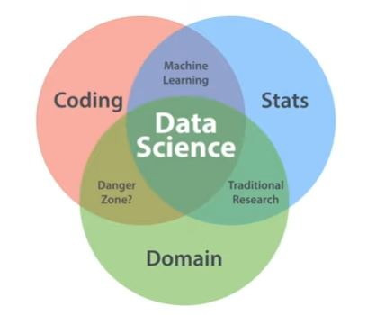

# Part 1: Data Science: An Introduction: Foundations of Data Science

## Demand for Data Science (2.1)

* unstrucutured data with meaning => usable data
* competative advatiages 

## The Data Science Venn Diagram (2.2)

Coding ∩ Stats ∩ Domain = Data Science
 

## The Data Science Pathway (2.3)
## Roles in Data Science (2.4)
## Teams in Data Science (2.5)
## Big Data (3.1)
## Coding (3.2)
## Statistics (3.3)
## Business Intelligence (3.4)
## Do No Harm (4.1)
## Methods Overview (5.1)
## Sourcing Overview (5.2)
## Coding Overview (5.3)
## Math Overview (5.4)
## Statistics Overview (5.5)
## Machine Learning Overview (5.6)
## Interpretability (6.1)
## Actionable Insights (6.2)
## Presentation Graphics (6.3)
## Reproducible Research (6.4)
## Next Steps (7.1)
    
# Part 2: Data Sourcing: Foundations of Data Science (1:39:46​)
## Welcome (1.1) 
## Metrics (2.1)
## Accuracy (2.2)
## Social Context of Measurement (2.3)
## Existing Data (3.1)
## APIs (3.2)
## Scraping (3.3)
## New Data (4.1)
## Interviews (4.2)
## Surveys (4.3)
## Card Sorting (4.4)
## Lab Experiments (4.5)
## A/B Testing (4.6)
## Next Steps (5.1)

# Part 3: Coding (2:32:42​)
## Welcome (1.1)
## Spreadsheets (2.1)
## Tableau Public (2.2)
## SPSS (2.3)
## JASP (2.4)
## Other Software (2.5)
## HTML (3.1)
## XML (3.2)
## JSON (3.3)
## R (4.1)
## Python (4.2)
## SQL (4.3)
## C, C++, & Java (4.4)
## Bash (4.5)
## Regex (5.1)
## Next Steps (6.1)
         
# Part 4: Mathematics (4:01:09​)
## Welcome (1.1)
## Elementary Algebra (2.1)
## Linear Algebra (2.2)
## Systems of Linear Equations (2.3)
## Calculus (2.4)
## Calculus & Optimization (2.5)
## Big O (3.1)
## Probability (3.2)
          
# Part 5: Statistics (4:44:03​)
## Welcome (1.1)
## Exploration Overview (2.1)
## Exploratory Graphics (2.2)
## Exploratory Statistics (2.3)
## Descriptive Statistics (2.4)
## Inferential Statistics (3.1)
## Hypothesis Testing (3.2)
## Estimation (3.3)
## Estimators (4.1)
## Measures of Fit (4.2)
## Feature Selection (4.3)
## Problems in Modeling (4.4)
## Model Validation (4.5)
## DIY (4.6)
## Next Step (5.1)
