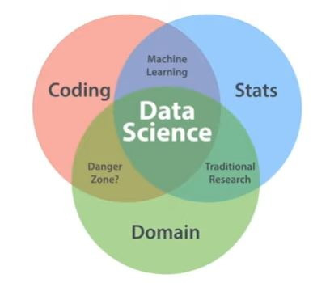

# Introduction

## Demand for Data Science (2.1)

* unstrucutured data with meaning => usable data
* competative advatiages 

## The Data Science Venn Diagram (2.2)

* Coding ∩ Stats ∩ Domain = Data Science
* Coding ∩ Stats = Machine Learning (coding & math \ domain => "stupid")
* Coding ∩ Domain = Danger Zone (coding & domain \ math => helpful)
* Stats ∩ Domain = Traditional Search (math & domain \ coding => manual)

 

* Coding => alter data to make it usable 
  * R & Python
  * SQL
  * CLI / Terminal / Bash
  * Search, Regex
* Math
  * Algebra, Regression
  * choose procedure
  * diagnose problems
* Domain
  * expertise in field
  * goals, methods

## The Data Science Pathway (2.3)

* Planning
    * define goals
    * organize resources
    * coordinate peolpe
    * schedule project
* Data Preparation
    * get data
    * clean data (laaarge part)
    * explore data
    * refine data
* Modeling
    * create model
    * validate model 
    * ecaluate model
    * refine model
* Follow-up
    * present model
    * deploy model (test live)
    * revisit model (things can change)
    * archive assets

## Roles in Data Science (2.4)

* engineer focusing on ard/software, base
* big data specialist focus science & math & machine learning
* researchers focussing domain stuff, strong analytics
* analyst, day-to-day tasks, google analytics
* business framing business-relevant questions, knowing data
* entrepreneur, data startups, 
* full-stack "unicorn" (everything in one, unicorns don't exist)

## Teams in Data Science (2.5)

Many tools existing, so: 

* Coding
* Statistics
* Design 
* Business