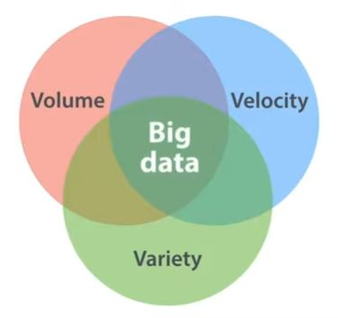
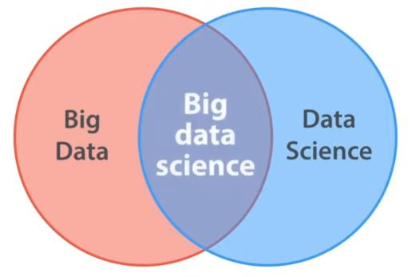

# Data
## Big Data (3.1)

Big data has:

* Volume
* Velocity
* Variety

 

"Normal" Data:

* just Volume => genetic code
* just Velocity => stream 
* just Variety => facial recognition

 

## Coding (3.2)

* Tools for coding
* Tools for Data Science
    * R
    * SQL
    * Python

## Statistics (3.3)

Statistics and Data Science are NOMA, Non-Overlapping Magistria. 
Yet they share tools ... an analysis.

* Trainings: data scientists not trained at as statisticians
* Practive: Machine learning & big data are not shared with statistics
* Data Scientiests work in different settings

## Business Intelligence (3.4)

* Data in real live
* data on internal operations, market, competitiors etc.
* goal is to make justifiable decisions => *goal-oriented* 
* simple statistics
* focus on domain expertise and utility => data dashboards
* identify data sources
* help get past easy questions
* GOOD DESIGN => wathc and learn